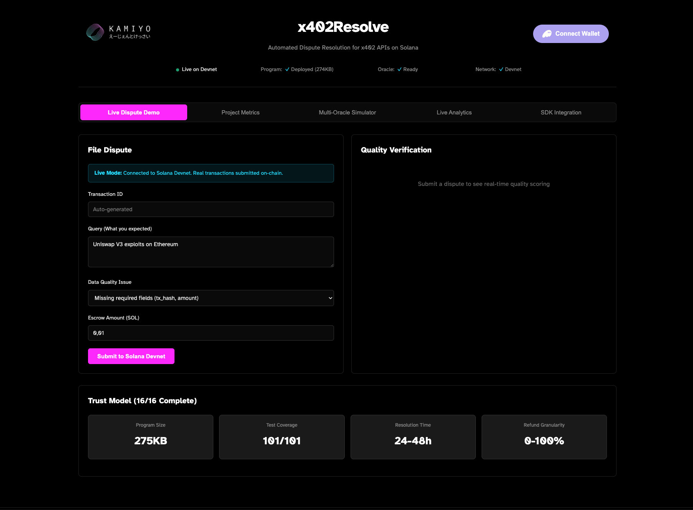

# x402Resolve




[](https://explorer.solana.com/address/ERjFnw8BMLo4aRx82itMogcPPrUzXh6Kd6pwWt6dgBbY?cluster=devnet)
[](LICENSE)
[](https://www.anchor-lang.com/)
[](https://www.typescriptlang.org/)

## Judges

**Quick Access Links:**
- **Live Demo**: https://x402kamiyo.github.io/x402resolve
- **API Endpoint**: https://x402resolve.kamiyo.ai
- **Devnet Program**: [`ERjFnw8BMLo4aRx82itMogcPPrUzXh6Kd6pwWt6dgBbY`](https://explorer.solana.com/address/ERjFnw8BMLo4aRx82itMogcPPrUzXh6Kd6pwWt6dgBbY?cluster=devnet)
- **Repository**: https://github.com/kamiyo-ai/x402resolve
- **Documentation**: [./docs/markdown/API_REFERENCE.md](./docs/markdown/API_REFERENCE.md)
- **Security Audit**: [./docs/security/SECURITY_AUDIT_REPORT.md](./docs/security/SECURITY_AUDIT_REPORT.md)

HTTP 402 Payment Required implementation with cryptographic quality verification and sliding-scale refunds.

## Overview

Extends RFC 9110 Section 15.5.3 (HTTP 402) with Solana escrow and multi-oracle quality assessment. Payments held in PDA until quality verified. Refunds proportional to quality score (0-100%).

**Technical Features:**
- Sliding-scale refunds based on quality metrics
- Multi-oracle verification (Python ML + Switchboard)
- PDA-based escrow without admin keys
- Ed25519 signature verification
- 99.9% cost reduction vs traditional chargebacks

## Quick Start

### For API Providers

```typescript
import { x402PaymentMiddleware } from '@x402resolve/middleware';

app.use('/api/*', x402PaymentMiddleware({
  realm: 'my-api',
  programId: ESCROW_PROGRAM_ID,
  connection,
  price: 0.001,
  qualityGuarantee: true
}));
```

### For API Consumers

```typescript
import { AutonomousServiceAgent } from '@x402resolve/agent-client';

const agent = new AutonomousServiceAgent({
  keypair: agentKeypair,
  connection,
  programId: ESCROW_PROGRAM_ID,
  qualityThreshold: 85,
  autoDispute: true
});

const result = await agent.consumeAPI(
  'https://api.example.com/data',
  { query: 'params' },
  { expectedSchema }
);
```

## Architecture

```
┌──────────┐    ┌────────┐    ┌─────┐    ┌────────┐
│  Client  │───▶│ Escrow │───▶│ API │◀──▶│ Oracle │
└──────────┘    └────────┘    └─────┘    └────────┘
                     │            │           │
                     │            │           │
                     │◀───────────┴───────────┘
                     │  Quality Assessment
                     │
                     ▼
              Sliding-Scale Refund
```

### Components

- **Solana Program** (`packages/x402-escrow`): PDA-based escrow with Ed25519 signature verification
- **TypeScript SDK** (`packages/x402-sdk`): Client library for escrow and dispute management
- **Python Verifier** (`packages/x402-verifier`): ML-based quality scoring (centralized)
- **Switchboard Function** (`packages/switchboard-function`): Decentralized quality oracle
- **HTTP 402 Middleware** (`packages/x402-middleware`): Express/FastAPI integration
- **Agent Client** (`packages/agent-client`): Autonomous agent with auto-dispute

## Quality Scoring

Multi-factor algorithm (0-100 scale):

```
Quality = (Completeness × 0.4) + (Accuracy × 0.3) + (Freshness × 0.3)

Refund = 100 - Quality  (for scores < 80)
```

**Example:**
- Quality: 65% → Refund: 35%
- Quality: 85% → Refund: 0%
- Quality: 40% → Refund: 100%

## Live Deployment

- **Program ID**: `ERjFnw8BMLo4aRx82itMogcPPrUzXh6Kd6pwWt6dgBbY`
- **Network**: Solana Devnet
- **API**: https://x402resolve.kamiyo.ai
- **Dashboard**: https://x402kamiyo.github.io/x402resolve

## Installation

```bash
git clone https://github.com/kamiyo-ai/x402resolve
cd x402resolve
npm install
npm run build
```

### Deploy Program

```bash
cd packages/x402-escrow
anchor build
anchor deploy
```

## Documentation

- [API Reference](./docs/markdown/API_REFERENCE.md)
- [Architecture](./docs/ARCHITECTURE_DIAGRAMS.md)
- [Security Audit](./docs/security/SECURITY_AUDIT_REPORT.md)
- [Troubleshooting](./TROUBLESHOOTING.md)

## Examples

- [Complete Flow](./examples/complete-flow) - End-to-end escrow workflow
- [Agent Dispute](./examples/agent-dispute) - Autonomous dispute filing
- [API Server](./examples/x402-api-server) - HTTP 402 implementation
- [Autonomous Agent](./examples/autonomous-agent) - Full agent autonomy

## Economics

Cost comparison at 1% dispute rate (100 disputes/month on $5,000 API spend):

| Method | Cost/Dispute | Total/Month | Resolution |
|--------|--------------|-------------|------------|
| Traditional | $35 | $3,500 | 30-90 days |
| x402Resolve | $0.005 | $0.50 | 48 hours |
| Reduction | 99.98% | 99.98% | 98% faster |

**Annual savings: $38,880** (92% reduction including refunds and infrastructure)

## Performance

| Metric | Value |
|--------|-------|
| Dispute Cost | $0.005 SOL |
| Resolution Time | 48 hours |
| Program Size | 275 KB |
| Test Coverage | 90+ tests |

## Security

- PDA-based escrow (no admin keys)
- Ed25519 signature verification
- Checked arithmetic (overflow protection)
- Time-lock protection (1h - 30d)
- Rent-exempt validation
- Multi-oracle consensus available

See [Security Audit](./docs/security/SECURITY_AUDIT_REPORT.md) for details.

## License

MIT | KAMIYO

**Contact**: dev@kamiyo.ai | [kamiyo.ai](https://kamiyo.ai)
