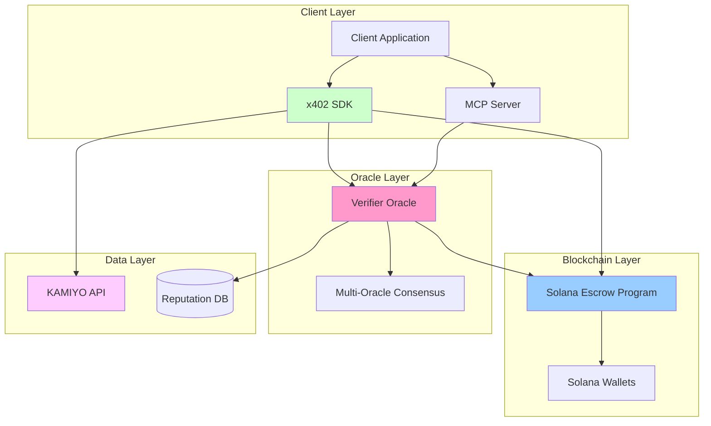
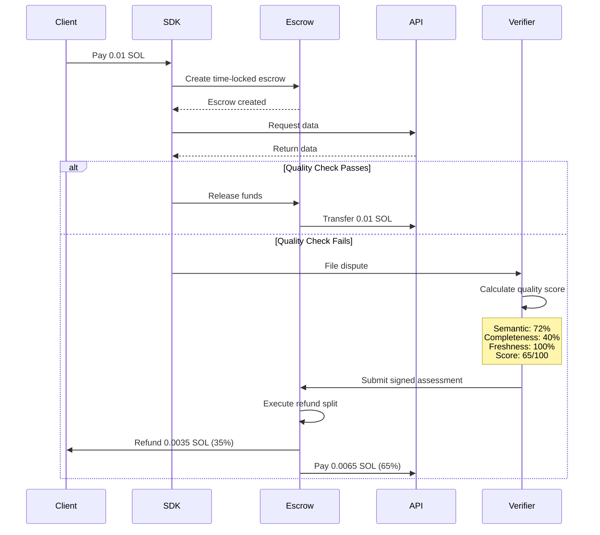
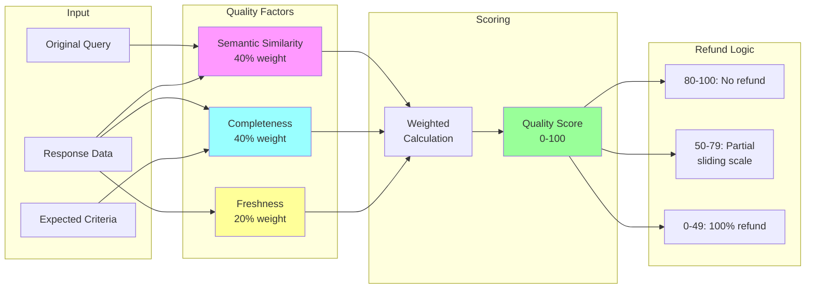

# x402Resolve

Automated dispute resolution system for x402 payment APIs on Solana.

Built by [KAMIYO](https://kamiyo.ai)

## Overview

x402Resolve implements escrow-based payments with programmatic dispute resolution for HTTP 402 APIs. The system provides objective quality assessment and sliding-scale refunds (0-100%) executed on-chain.

**Live Demo**: https://x402kamiyo.github.io/x402resolve

**Devnet Program**: `AFmBBw7kbrnwhhzYadAMCMh4BBBZcZdS3P7Z6vpsqsSR` ([Explorer](https://explorer.solana.com/address/AFmBBw7kbrnwhhzYadAMCMh4BBBZcZdS3P7Z6vpsqsSR?cluster=devnet))

## Problem

Cryptocurrency payments for APIs are irreversible with no quality guarantees. Traditional chargebacks require weeks of manual arbitration.

## Solution

Time-locked Solana escrow combined with automated quality verification enables fair refunds within 24-48 hours without manual intervention.

**Key Components**:
- Multi-factor quality algorithm (semantic similarity 40%, completeness 40%, freshness 20%)
- Ed25519-signed oracle assessments verified on-chain
- Sliding-scale refunds based on objective quality metrics
- On-chain reputation system (0-1000 score)

## Quick Start

```typescript
import { KamiyoClient } from '@kamiyo/x402-sdk';

const client = new KamiyoClient({
  apiUrl: 'https://api.kamiyo.ai',
  enablex402Resolve: true
});

// Create escrow payment
const payment = await client.pay({
  amount: 0.01,
  recipient: apiWallet,
  enableEscrow: true
});

// Dispute automatically filed if quality check fails
const dispute = await client.dispute({
  transactionId: payment.transactionId,
  reason: 'Incomplete data',
  evidence: data
});

console.log(`Refund: ${dispute.refundPercentage}%`);
```

## Installation

```bash
# Clone repository
git clone https://github.com/x402kamiyo/x402resolve
cd x402resolve

# Install SDK
cd packages/x402-sdk
npm install && npm run build

# Install verifier oracle
cd ../x402-verifier
pip install -r requirements.txt

# Build Solana program
cd ../x402-escrow
anchor build
```

## Architecture

### System Overview



### Payment & Dispute Flow



### Quality Scoring Algorithm



[Complete Architecture Diagrams](./docs/ARCHITECTURE_DIAGRAMS.md)

## Components

### 1. Solana Escrow Program (`packages/x402-escrow/`)

Rust/Anchor smart contract implementing on-chain dispute resolution.

**Instructions**:
- `initialize_escrow`: Create time-locked PDA escrow account
- `release_funds`: Release payment after dispute window expires
- `mark_disputed`: Mark escrow as under dispute
- `resolve_dispute`: Execute refund split based on verified quality score

**Security**:
- PDA-based escrow (deterministic addresses, no private keys)
- Ed25519 signature verification from oracle
- Time-lock prevents indefinite holding (7-day maximum)
- Checked arithmetic prevents overflow

**Program Size**: 275 KB
**Test Coverage**: 101/101 passing

### 2. Verifier Oracle (`packages/x402-verifier/`)

Python/FastAPI service for objective quality scoring.

**Algorithm**:
```python
quality_score = (
    semantic_similarity * 0.4 +    # Cosine similarity using sentence-transformers
    completeness_score * 0.4 +     # Required field validation
    freshness_score * 0.2          # Data recency check
) * 100

# Refund calculation
if quality_score >= 80:
    refund = 0%          # Acceptable quality
elif quality_score >= 50:
    refund = variable    # Sliding scale
else:
    refund = 100%        # Unacceptable quality
```

Results are signed with Ed25519 and verified on-chain.

### 3. TypeScript SDK (`packages/x402-sdk/`)

Client library for programmatic integration.

**Features**:
- Escrow creation and management
- Automated dispute filing
- Reputation tracking
- Retry handling with exponential backoff
- Type-safe API

### 4. MCP Server (`packages/mcp-server/`)

Model Context Protocol server for AI agent integration.

**Available Tools**:
- `health_check`: Server status and connectivity
- `search_crypto_exploits`: Query KAMIYO exploit database
- `assess_defi_protocol_risk`: Protocol security analysis
- `monitor_wallet`: Check wallet exposure to compromised protocols
- `file_dispute`: Submit quality dispute with evidence

## Trust Model

x402Resolve implements 16 trust features addressing autonomous agent commerce:

### 1. Agent Trust
- On-chain audit trail (immutable transaction records)
- Cryptographic verification (Ed25519 signatures)
- Objective quality scoring (removes human bias)
- Agent reputation system (0-1000 on-chain score)

### 2. Scope Definition
- Query-based specification
- Structured work agreements (WorkAgreement struct on-chain)
- Pre-flight validation

### 3. Dispute Resolution
- Automated resolution (zero manual intervention)
- Fair refunds (sliding scale 0-100%)
- Multi-tier escalation support
- Provider penalties (strike system, 4 strikes = permanent ban)

### 4. Reputation & Refunds
- Automated verifier oracle (multi-factor algorithm)
- On-chain execution (smart contract enforced)
- Ed25519 signed results

### 5. Exploitation Prevention
- Time-lock protection (7-day maximum)
- PDA-based security (deterministic, collision-resistant)
- Rate limiting (per-entity hourly/daily limits)
- Dispute cost scaling (1x-10x based on abuse rate)
- Sybil attack protection (graduated verification levels)

[Complete Trust Model](./TRUST_MODEL.md)

## Repository Structure

```
x402resolve/
├── packages/
│   ├── x402-sdk/          # TypeScript client library
│   ├── x402-verifier/     # Python quality oracle
│   ├── x402-escrow/       # Rust/Anchor Solana program
│   └── mcp-server/        # MCP protocol server
├── examples/
│   ├── basic-payment/
│   ├── with-dispute/
│   ├── complete-flow/
│   ├── agent-dispute/
│   └── mcp-integration/
├── docs/
│   ├── index.html         # Live demo
│   ├── ARCHITECTURE_DIAGRAMS.md
│   └── markdown/          # Technical documentation
└── tests/
    └── integration/       # End-to-end tests
```

## Technical Details

### Quality Scoring Example

```
Query: "Uniswap V3 exploit history on Ethereum"
Data:  3 exploits (Curve, Euler, Mango) - wrong protocols

┌────────────────────────────────────┐
│ MULTI-FACTOR SCORING               │
├────────────────────────────────────┤
│ Semantic Similarity (40%)          │
│ • Cosine similarity: 0.72          │
│ • Contribution: 0.288              │
├────────────────────────────────────┤
│ Completeness (40%)                 │
│ • Wrong protocols, incomplete      │
│ • Score: 0.40                      │
│ • Contribution: 0.160              │
├────────────────────────────────────┤
│ Freshness (20%)                    │
│ • Recent data                      │
│ • Score: 1.00                      │
│ • Contribution: 0.200              │
└────────────────────────────────────┘

Quality Score: (0.288 + 0.160 + 0.200) × 100 = 65/100

┌────────────────────────────────────┐
│ REFUND CALCULATION                 │
├────────────────────────────────────┤
│ Score: 65 (50-79 range)            │
│ Refund: 35%                        │
│                                    │
│ Client receives: 0.0035 SOL        │
│ API receives:    0.0065 SOL        │
└────────────────────────────────────┘
```

### Security

- Ed25519 signatures validated on-chain
- PDA-based escrow (deterministic, collision-resistant)
- Time-lock prevents indefinite escrow
- Checked arithmetic prevents overflow
- Open source, auditable code

[Security Audit Report](./SECURITY_AUDIT.md)

## Development

### Prerequisites

- Node.js 18+
- Python 3.9+
- Rust + Anchor CLI
- Solana CLI

### Running Tests

```bash
# TypeScript SDK tests
cd packages/x402-sdk
npm test

# Python verifier tests
cd packages/x402-verifier
pytest

# Rust program tests
cd packages/x402-escrow
anchor test

# Integration tests
cd tests/integration
npm test
```

### Running Examples

```bash
# Basic payment
cd examples/basic-payment
npm install
ts-node index.ts

# With dispute resolution
# Terminal 1: Start verifier
cd packages/x402-verifier
python verifier.py

# Terminal 2: Run example
cd examples/with-dispute
ts-node index.ts
```

## Deployment

### Devnet (Current)
Program ID: `AFmBBw7kbrnwhhzYadAMCMh4BBBZcZdS3P7Z6vpsqsSR`

### Mainnet
See [Mainnet Deployment Guide](./docs/markdown/MAINNET_DEPLOYMENT.md)

Estimated cost: 2-3 SOL (one-time)

## Documentation

- [Architecture Diagrams](./docs/ARCHITECTURE_DIAGRAMS.md)
- [Trust Model](./TRUST_MODEL.md)
- [Security Audit](./SECURITY_AUDIT.md)
- [Multi-Oracle Design](./docs/markdown/MULTI_ORACLE_DESIGN.md)
- [Edge Cases](./docs/markdown/EDGE_CASES.md)
- [Test Results](./docs/markdown/TEST_RESULTS.md)
- [Use Cases](./docs/markdown/USE_CASES.md)

## Hackathon Submission

This project is submitted to the Solana x402 Hackathon 2025.

**Tracks**:
- Best MCP Server: 5 production tools with automated dispute filing
- Best Dev Tool: Complete toolkit (SDK, oracle, smart contract)
- Best Agent Application: End-to-end automated workflow
- Best API Integration: KAMIYO exploit intelligence with x402 payment layer

**Key Metrics**:
- 275 KB optimized Solana program
- 101/101 tests passing
- 24-48 hour resolution time (vs weeks manual)
- 0-100% refund granularity (vs binary)
- 16/16 trust features implemented

## Contributing

See [CONTRIBUTING.md](./CONTRIBUTING.md)

## Security

See [SECURITY.md](./SECURITY.md)

For security issues, email: security@kamiyo.ai

## License

MIT

## Links

- Website: https://kamiyo.ai
- GitHub: https://github.com/x402kamiyo/x402resolve
- Demo: https://x402kamiyo.github.io/x402resolve
- Devnet Explorer: https://explorer.solana.com/address/AFmBBw7kbrnwhhzYadAMCMh4BBBZcZdS3P7Z6vpsqsSR?cluster=devnet
