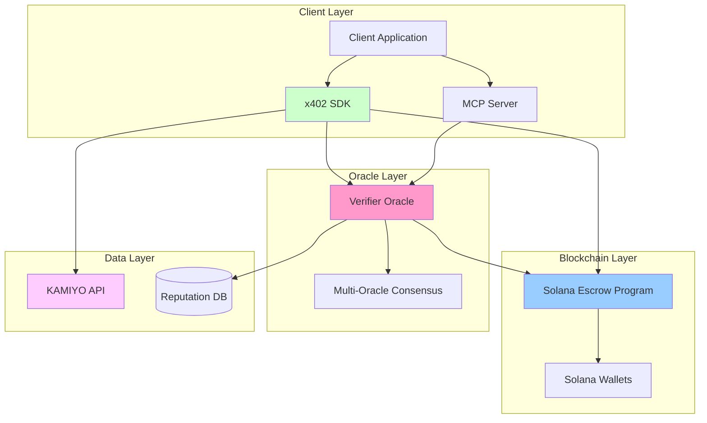
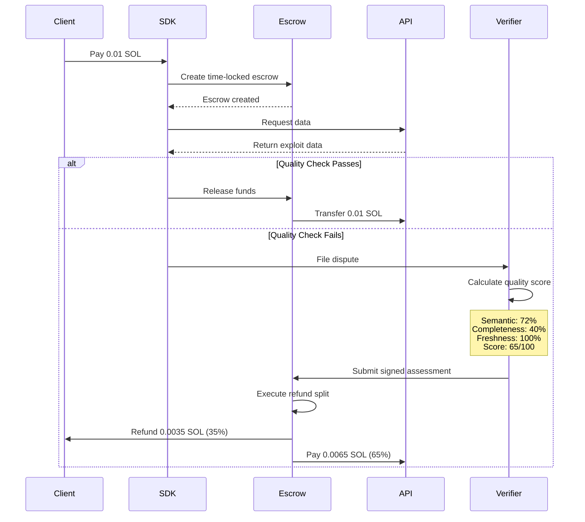
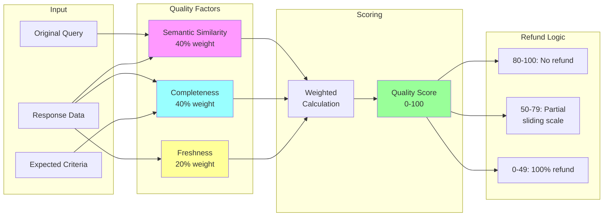
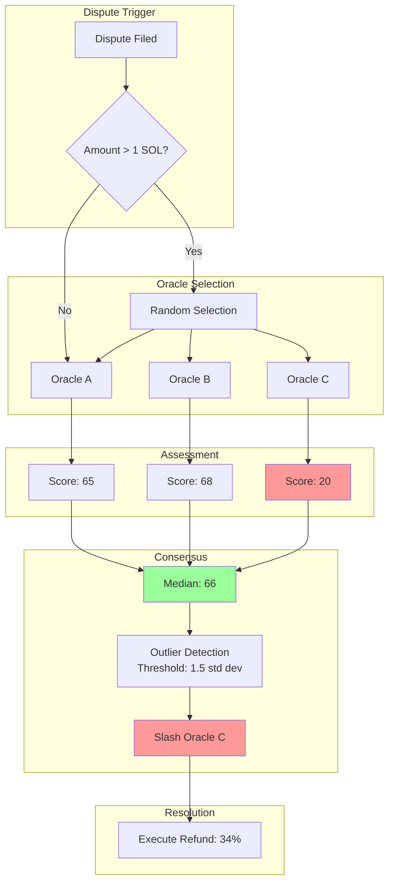
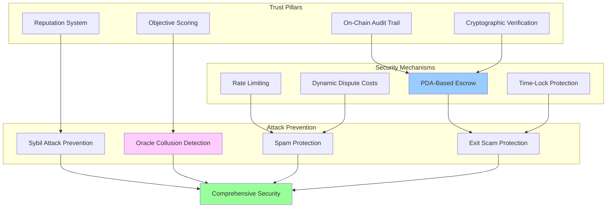
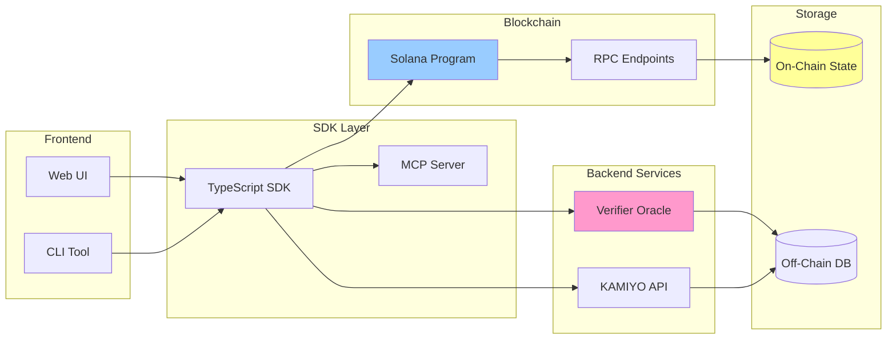

# x402Resolve Architecture Diagrams

Visual representations of the x402Resolve system architecture, data flows, and trust mechanisms.

## Table of Contents

1. [High-Level System Architecture](#high-level-system-architecture)
2. [Payment and Dispute Flow](#payment-and-dispute-flow)
3. [Quality Scoring Pipeline](#quality-scoring-pipeline)
4. [Multi-Oracle Consensus (Phase 2)](#multi-oracle-consensus-phase-2)
5. [Trust and Security Model](#trust-and-security-model)
6. [Component Interaction](#component-interaction)

---

## High-Level System Architecture



### ASCII Version

```
┌─────────────────────────────────────────────────────────┐
│                    CLIENT LAYER                         │
│                                                         │
│  ┌──────────┐    ┌──────────┐    ┌──────────┐         │
│  │  Client  │───▶│   SDK    │    │   MCP    │         │
│  │   App    │    │ Library  │    │  Server  │         │
│  └──────────┘    └─────┬────┘    └─────┬────┘         │
└────────────────────────┼───────────────┼───────────────┘
                         │               │
                         ▼               ▼
┌─────────────────────────────────────────────────────────┐
│                  BLOCKCHAIN LAYER                       │
│                                                         │
│  ┌──────────────────────────────────────┐              │
│  │   Solana Escrow Smart Contract       │              │
│  │   • Time-locked PDAs                 │              │
│  │   • Signature verification           │              │
│  │   • Automated refund execution       │              │
│  └──────────────────────────────────────┘              │
└─────────────────────────────────────────────────────────┘
                         │
                         ▼
┌─────────────────────────────────────────────────────────┐
│                    ORACLE LAYER                         │
│                                                         │
│  ┌──────────────┐         ┌──────────────┐            │
│  │   Verifier   │────────▶│ Multi-Oracle │            │
│  │    Oracle    │         │  Consensus   │            │
│  │ (Quality AI) │         │ (Phase 2)    │            │
│  └──────────────┘         └──────────────┘            │
└─────────────────────────────────────────────────────────┘
                         │
                         ▼
┌─────────────────────────────────────────────────────────┐
│                     DATA LAYER                          │
│                                                         │
│  ┌──────────┐              ┌──────────┐               │
│  │ KAMIYO   │              │Reputation│               │
│  │   API    │              │ Database │               │
│  └──────────┘              └──────────┘               │
└─────────────────────────────────────────────────────────┘
```

---

## Payment and Dispute Flow



### ASCII Version

```
CLIENT          SDK         ESCROW        API       VERIFIER
  │              │             │            │            │
  ├─Pay 0.01 SOL─▶            │            │            │
  │              ├─Create──────▶           │            │
  │              │  Escrow     │            │            │
  │              ◀─Created─────┤            │            │
  │              │             │            │            │
  │              ├─Request data─────────────▶           │
  │              ◀─Exploit data──────────────           │
  │              │             │            │            │
  │              │             │            │            │
  │         ┌────┴────┐        │            │            │
  │         │ Quality │        │            │            │
  │         │  Check  │        │            │            │
  │         └────┬────┘        │            │            │
  │              │             │            │            │
  │         ╔════╧════╗        │            │            │
  │         ║  FAIL   ║        │            │            │
  │         ╚════╤════╝        │            │            │
  │              │             │            │            │
  │              ├─File dispute────────────────────────▶ │
  │              │             │            │            │
  │              │             │            │  ┌─────────┴────────┐
  │              │             │            │  │ Calculate Score  │
  │              │             │            │  │ • Semantic: 72%  │
  │              │             │            │  │ • Complete: 40%  │
  │              │             │            │  │ • Fresh: 100%    │
  │              │             │            │  │ ───────────────  │
  │              │             │            │  │ Score: 65/100    │
  │              │             │            │  │ Refund: 35%      │
  │              │             │            │  └─────────┬────────┘
  │              │             │            │            │
  │              │             ◀──Sign assessment────────┤
  │              │             │            │            │
  │              │          ┌──┴───┐        │            │
  │              │          │Split │        │            │
  │              │          │Refund│        │            │
  │              │          └──┬───┘        │            │
  │              │             │            │            │
  │    ◀─────────────Refund────┤            │            │
  │   0.0035 SOL  │      35%   │            │            │
  │              │             │            │            │
  │              │             ├──Pay───────▶           │
  │              │             │ 0.0065 SOL │            │
  │              │             │    65%     │            │
```

---

## Quality Scoring Pipeline



### Detailed Breakdown

```
┌──────────────────────────────────────────────────────────────┐
│                  QUALITY SCORING ALGORITHM                   │
└──────────────────────────────────────────────────────────────┘

INPUT
┌─────────────────────┐
│ Original Query      │ → "Uniswap V3 exploits on Ethereum"
├─────────────────────┤
│ Response Data       │ → 3 exploits (Curve, Euler, Mango)
├─────────────────────┤
│ Expected Criteria   │ → min 5 records, required fields
└─────────────────────┘
           │
           ▼
┌──────────────────────────────────────────────────────────────┐
│                    MULTI-FACTOR SCORING                      │
├──────────────────────────────────────────────────────────────┤
│                                                              │
│  ┌────────────────────────────────────┐                     │
│  │ SEMANTIC SIMILARITY (40%)          │                     │
│  │ ──────────────────────────────     │                     │
│  │ • Sentence embedding: Query        │                     │
│  │ • Sentence embedding: Data         │                     │
│  │ • Cosine similarity calculation    │                     │
│  │ • Result: 0.72 (72%)               │                     │
│  └────────────────────────────────────┘                     │
│           │                                                  │
│           │                                                  │
│  ┌────────────────────────────────────┐                     │
│  │ COMPLETENESS (40%)                 │                     │
│  │ ──────────────────────────────     │                     │
│  │ • Required fields present: 80%     │                     │
│  │ • Minimum records met: No (3/5)    │                     │
│  │ • Correct protocols: No            │                     │
│  │ • Result: 0.40 (40%)               │                     │
│  └────────────────────────────────────┘                     │
│           │                                                  │
│           │                                                  │
│  ┌────────────────────────────────────┐                     │
│  │ FRESHNESS (20%)                    │                     │
│  │ ──────────────────────────────     │                     │
│  │ • Data age check                   │                     │
│  │ • Within 30 days: Yes              │                     │
│  │ • Result: 1.00 (100%)              │                     │
│  └────────────────────────────────────┘                     │
│                                                              │
└──────────────────────────────────────────────────────────────┘
           │
           ▼
┌──────────────────────────────────────────────────────────────┐
│                   WEIGHTED CALCULATION                       │
└──────────────────────────────────────────────────────────────┘

  Quality = (0.72 × 0.4) + (0.40 × 0.4) + (1.00 × 0.2)
          = 0.288 + 0.160 + 0.200
          = 0.648
          = 64.8/100 ≈ 65/100

           │
           ▼
┌──────────────────────────────────────────────────────────────┐
│                    REFUND CALCULATION                        │
├──────────────────────────────────────────────────────────────┤
│                                                              │
│  Score: 65/100 → Falls in 50-79 range                       │
│                                                              │
│  Refund = 100% - Quality Score                              │
│         = 100% - 65%                                         │
│         = 35%                                                │
│                                                              │
│  Client receives: 0.01 × 0.35 = 0.0035 SOL                  │
│  API receives:    0.01 × 0.65 = 0.0065 SOL                  │
│                                                              │
└──────────────────────────────────────────────────────────────┘
```

---

## Multi-Oracle Consensus (Phase 2)



### Consensus Algorithm

```
┌──────────────────────────────────────────────────────────────┐
│              MULTI-ORACLE CONSENSUS MECHANISM                │
└──────────────────────────────────────────────────────────────┘

PHASE 1: ORACLE SELECTION
┌────────────────────────────────────────────────────────────┐
│  Random Selection Algorithm                                │
│  ────────────────────────────                              │
│  • VRF-based randomness (Solana)                          │
│  • Select 3 from staked oracle pool                       │
│  • 10 SOL minimum stake required                          │
│  • Exclude recently selected oracles                      │
└────────────────────────────────────────────────────────────┘

PHASE 2: PARALLEL ASSESSMENT
┌────────────────────────────────────────────────────────────┐
│                                                            │
│  Oracle A  →  Quality Score: 65  ──┐                      │
│  Oracle B  →  Quality Score: 68  ──┼─→  [Collect]        │
│  Oracle C  →  Quality Score: 20  ──┘                      │
│               (Outlier!)                                   │
│                                                            │
└────────────────────────────────────────────────────────────┘

PHASE 3: STATISTICAL ANALYSIS
┌────────────────────────────────────────────────────────────┐
│  Median Calculation                                        │
│  ─────────────────                                         │
│  Scores: [20, 65, 68]                                      │
│  Sorted: [20, 65, 68]                                      │
│  Median: 65                                                │
│                                                            │
│  Outlier Detection                                         │
│  ─────────────────                                         │
│  Mean: 51                                                  │
│  Std Dev: 26.8                                             │
│  Threshold: 1.5 × 26.8 = 40.2                             │
│                                                            │
│  Oracle C (20) is outlier:                                │
│  |20 - 51| = 31 > 40.2? No, but...                        │
│  |20 - 66.5| = 46.5 > 40.2? Yes! → SLASH                  │
│                                                            │
└────────────────────────────────────────────────────────────┘

PHASE 4: SLASHING & RESOLUTION
┌────────────────────────────────────────────────────────────┐
│  Slashing Tiers                                            │
│  ──────────────                                            │
│  1st offense:  Warning + flag                             │
│  2nd offense:  10% stake slash                            │
│  3rd offense:  50% stake slash                            │
│  4th offense:  100% stake slash + permanent ban           │
│                                                            │
│  Final Score: 66 (median of 65, 68)                       │
│  Refund: 34%                                               │
│                                                            │
└────────────────────────────────────────────────────────────┘
```

---

## Trust and Security Model



---

## Component Interaction



### Data Flow Example

```
┌─────────────────────────────────────────────────────────────┐
│          END-TO-END TRANSACTION DATA FLOW                   │
└─────────────────────────────────────────────────────────────┘

1. PAYMENT INITIATION
   ┌──────────┐
   │  Client  │ → payment(amount, recipient)
   └────┬─────┘
        │
        ▼
   ┌──────────┐
   │   SDK    │ → createEscrow(params)
   └────┬─────┘
        │
        ▼
   ┌──────────┐
   │  Solana  │ → PDA created, funds locked
   │  Program │    Time-lock: 7 days
   └──────────┘

2. DATA RETRIEVAL
   ┌──────────┐
   │   SDK    │ → fetchData(query)
   └────┬─────┘
        │
        ▼
   ┌──────────┐
   │ KAMIYO   │ → exploit_data[]
   │   API    │    (Curve, Euler, Mango)
   └──────────┘

3. QUALITY CHECK
   ┌──────────┐
   │   SDK    │ → validateQuality(data, criteria)
   └────┬─────┘
        │
        ▼ (FAIL)
   ┌──────────┐
   │   SDK    │ → fileDispute(evidence)
   └────┬─────┘
        │
        ▼
   ┌──────────┐
   │ Verifier │ → calculateScore()
   │  Oracle  │    - Semantic: 72%
   └────┬─────┘    - Complete: 40%
        │          - Fresh: 100%
        │          → Score: 65
        ▼
   ┌──────────┐
   │  Sign    │ → Ed25519 signature
   │  Result  │
   └──────────┘

4. REFUND EXECUTION
   ┌──────────┐
   │  Solana  │ → verifySignature()
   │  Program │    validateScore()
   └────┬─────┘    executeRefund()
        │
        ├─→ Client:  0.0035 SOL (35%)
        └─→ API:     0.0065 SOL (65%)

5. REPUTATION UPDATE
   ┌──────────┐
   │ Off-Chain│ → updateReputation()
   │    DB    │    - Client: +partial_win
   └──────────┘    - API: +quality_issue
                   - Verifier: +assessment
```

---

## Legend

**Colors in Mermaid Diagrams**:
- 🔵 Blue (`#9cf`): Blockchain/Smart Contracts
- 🟣 Pink (`#f9c`, `#fcf`): Oracle/Verification Layer
- 🟢 Green (`#cfc`, `#9f9`): Client SDKs/Success States
- 🔴 Red (`#f99`): Errors/Slashing/Failures
- 🟡 Yellow (`#ff9`): Storage/State

**Symbols in ASCII Diagrams**:
- `─`, `│`, `┌`, `┐`, `└`, `┘`: Box borders
- `▶`, `◀`, `▼`, `▲`: Flow direction
- `├`, `┤`, `┬`, `┴`, `┼`: Connections
- `╔`, `╗`, `╚`, `╝`, `║`, `═`: Decision boxes

---

For implementation details, see:
- [TRUST_MODEL.md](../TRUST_MODEL.md) - Complete trust architecture
- [SECURITY_AUDIT.md](../SECURITY_AUDIT.md) - Security analysis
- [README.md](../README.md) - System overview
